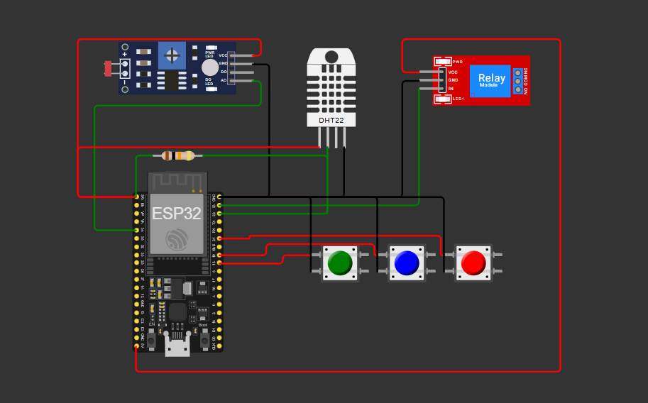

# FIAP - Faculdade de Informática e Administração Paulista

 

# Sensor de Irrigação FarmTech Solutions

<a href= "https://youtu.be/bn1UaVN9CCs">Funcionamento do Circuito no Youtube</a>

##  Grupo 30

## 👨‍🎓 Integrantes: 
- <a href="https://www.linkedin.com/in/amanda-damasceno-martins/">566598 - Amanda Damasceno Martins</a>
- <a href="https://www.linkedin.com/in/cauasantoslt">566599 - Cauã Santos</a>
- <a href="https://www.linkedin.com/in/fabio-baldo-7959a22a/">567851 - Fabio Baldo</a> 
- <a href="https://www.linkedin.com/in/giovanna-gomes-82b993372/">567169 - Giovanna Gomes Oliveira</a> 
- <a href="https://www.linkedin.com/in/roberto-alvares-785059215/">568265 - Roberto Almeida Alvares</a>

## 👩‍🏫 Professores:
### Tutor(a) 
- <a href="https://www.linkedin.com/in/sabrina-otoni-22525519b/">Sabrina Otoni</a>
### Coordenador(a)
- <a href="https://www.linkedin.com/in/andregodoichiovato/">André Godoi</a>

## 📜 Descrição

Este projeto, desenvolvido para a Fase 2 da FarmTech Solutions, consiste em um protótipo de sistema de irrigação inteligente simulado, focado na otimização do cultivo de **tomates** 🍅. Utilizando um microcontrolador **ESP32**, o sistema monitora em tempo real as condições essenciais do solo para decidir de forma autônoma o momento ideal para a irrigação.

Para superar as limitações da plataforma de simulação Wokwi, foram adotadas substituições didáticas para os sensores agrícolas:

-  **Níveis de Nutrientes(NPK):** Três botões simulam a detecção de deficiência de Nitrogênio (N), Fósforo (P) e Potássio (K). Ao serem pressionados, geram alertas no sistema.

- **pH do Solo:** Um sensor de luz (LDR) é utilizado para simular a leitura de pH, mapeando a intensidade luminosa para a escala de pH (0-14).

- **Umidade do Solo:** Um sensor de umidade do ar (DHT22) é empregado para representar a umidade do solo.

O objetivo central é acionar um relé, que representa uma bomba d'água 💧, apenas quando necessário. A lógica de decisão para a irrigação é baseada em regras específicas para a cultura do tomate: a bomba é ativada quando a umidade cai abaixo de 60% e o pH está na faixa ideal (entre 6.0 e 6.8). O sistema também demonstra como a deficiência de nutrientes (simulada pelos botões) influencia indiretamente o processo, alertando o operador sobre a necessidade de correção do solo, o que consequentemente afetaria o pH.

## 📁 Estrutura de pastas

Dentre os arquivos e pastas presentes na raiz do projeto, definem-se:

- <b>.github</b>: Nesta pasta ficarão os arquivos de configuração específicos do GitHub que ajudam a gerenciar e automatizar processos no repositório.

- <b>assets</b>: aqui estão os arquivos relacionados a elementos não-estruturados deste repositório, como imagens.

- <b>config</b>: Posicione aqui arquivos de configuração que são usados para definir parâmetros e ajustes do projeto.

- <b>document</b>: aqui estão todos os documentos do projeto que as atividades poderão pedir. Na subpasta "other", adicione documentos complementares e menos importantes.

- <b>scripts</b>: Posicione aqui scripts auxiliares para tarefas específicas do seu projeto. Exemplo: deploy, migrações de banco de dados, backups.

- <b>src</b>: Todo o código fonte criado para o desenvolvimento do projeto ao longo das 7 fases.

- <b>README.md</b>: arquivo que serve como guia e explicação geral sobre o projeto (o mesmo que você está lendo agora).

## 🔧 Como executar o código

Este projeto foi desenvolvido utilizando PlatformIO com Visual Studio Code e pode ser totalmente executado em um ambiente de simulação Wokwi.

### Pré-requisitos
- **Visual Studio Code:** Editor de código onde o projeto foi desenvolvido.

- **Extensão PlatformIO IDE:** Essencial para compilar o código e gerenciar as dependências do ESP32.

- **Extensão Wokwi for VS Code:** Permite rodar a simulação do circuito diretamente no VS Code.

### Passo a Passo para Execução
1. **Abra o Projeto:** Clone este repositório e abra a pasta raiz no Visual Studio Code.

2. **Instale as Dependências:** O PlatformIO irá detectar o arquivo platformio.ini e deve instalar automaticamente as bibliotecas necessárias para o sensor DHT22.

2. **Compile o Código:** Na barra de status inferior do VS Code, clique no ícone de ✔️ (Build). Aguarde a compilação ser concluída com sucesso.

4. ### Inicie a Simulação:

Pressione F1 para abrir a paleta de comandos.

Digite e selecione a opção "Wokwi: Start Simulator".

5. ### Interaja com o Sistema:

- Uma nova aba com o circuito simulado irá aparecer.

- Ajuste os sliders dos sensores **DHT22 (Umidade)** e **LDR (pH)** para atender às condições de irrigação.

- Pressione os botões **(N, P, K)** para simular alertas de deficiência de nutrientes.

- Acompanhe toda a telemetria e os alertas no painel do **Monitor Serial**.

## 📋 Licença

<a property="dct:title" rel="cc:attributionURL" href="https://github.com/agodoi/template">MODELO GIT FIAP</a> por <a rel="cc:attributionURL dct:creator" property="cc:attributionName" href="https://fiap.com.br">Fiap</a> está licenciado sobre <a href="http://creativecommons.org/licenses/by/4.0/?ref=chooser-v1" target="_blank" rel="license noopener noreferrer" style="display:inline-block;">Attribution 4.0 International</a>.

